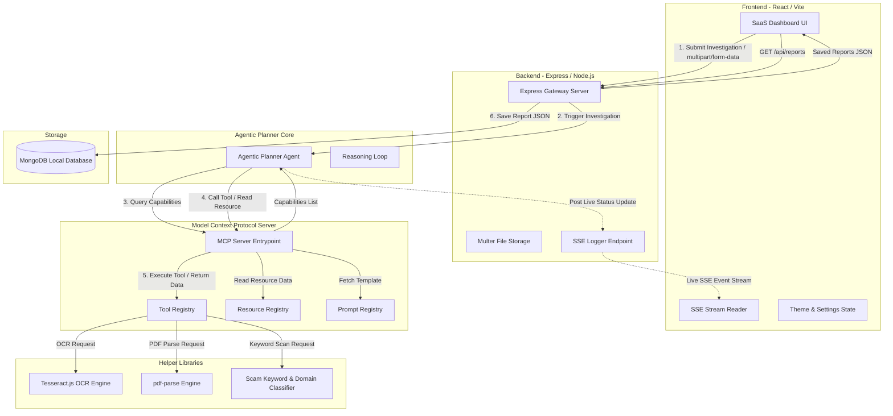

# TruthShield AI - Implementation Plan
## Agentic AI Cyber Investigation Platform
### Designed for Amrita Vishwa Vidyapeetham MCP Hackathon 2026

---

## 1. Executive Summary

### Project Objective
The objective of **TruthShield AI** is to build a production-quality, agentic cyber investigation platform. The platform is designed to inspect digital artifacts—unstructured scam text, suspicious URLs, official-looking PDF notices, and screenshot images—and determine if they are fraudulent (phishing, financial scams, or imposter government notifications). 

### Why Agentic AI is Required
Traditional classification systems rely on static rule engines or simple machine learning classifiers. These are brittle and fail to adapt to complex, multi-vector threats (e.g., a PDF notice containing a QR code leading to a shortened URL that mimics a banking portal). 
An **Agentic AI Planner** is required to:
1. **Analyze dynamically**: Adapt its investigation strategy based on the nature of the input evidence.
2. **Reason iteratively**: Evaluate the outputs of intermediate tools (e.g., extracting a URL from a PDF) and decide to spawn subsequent analysis runs (e.g., scanning the extracted URL).
3. **Synthesize contexts**: Combine cross-modal evidence (OCR text + URL analysis) to form a unified risk vector.

### Why Model Context Protocol (MCP) is Used
The **Model Context Protocol (MCP)**, developed by Anthropic, is a state-of-the-art open standard that enables secure, bi-directional communication between large language models (LLMs) and local or remote data sources, tools, and prompts. 
By utilizing MCP:
1. **Separation of Concerns**: The LLM is decoupled from the host environment. The tools (OCR, network scanner, PDF parser) reside safely behind the MCP Server.
2. **Standardization**: MCP provides a unified JSON-RPC 2.0 schema for tool execution, resource reading, and prompt templating.
3. **Context Security**: The LLM cannot access system services directly. It must request tools and read resources through the formal protocol boundary.

### Differences from a Traditional AI Chatbot
| Feature | Traditional AI Chatbot | TruthShield AI Investigation Platform |
| :--- | :--- | :--- |
| **Operational Mode** | Conversational / Reactive | Autonomous / Goal-Oriented |
| **Capabilities** | Text generation and basic retrieval | File execution, OCR, URL security checks, parsing |
| **System Boundary** | Bound to LLM knowledge cutoff / RAG | Live execution via MCP primitives |
| **Workflow** | Static text replies | Dynamic execution timeline with real-time log stream |
| **Orchestration** | User guides the conversation | Planner Agent independently schedules and merges tools |

---

## 2. Complete System Architecture

The following diagram illustrates the component relationships, data flow, communication interfaces, and runtime environments.



### Communication and Data Flow Steps
1. **Submission**: The user uploads evidence (Scam text, URL, PDF, and/or Image) through the frontend interface. The files are uploaded to the Express backend via `Multer` and stored temporarily.
2. **Planner Trigger**: Express triggers the `Planner Agent` with paths to the uploaded files and raw texts.
3. **Dynamic Discovery**: The Planner sends a standard `ListTools` and `ListResources` request to the MCP Server.
4. **Execution Cycle**:
   - The Planner selects the appropriate tools (e.g., `OCRAnalysisTool` if an image is present).
   - The Planner requests tool execution via JSON-RPC.
   - The MCP Server runs the underlying services (`Tesseract.js`, `pdf-parse`) and returns the structured results.
5. **Prompt-Guided Merge**: The Planner reads the `Generate Report` prompt template from the Prompt Registry, formats it with the collected tool outputs, and uses it to synthesize the unified report.
6. **Persistence**: The Express server persists the final report to MongoDB.
7. **Decoupled Local Logging & SSE Stream**:
   - The MCP child process writes timeline execution logs synchronously to a local transaction log file: `/uploads/session_${sessionId}.log`.
   - This decouples the spawned child process from direct database network calls, eliminating double-connection latency and Windows-specific DNS/socket timeout errors.
   - The Express server gateway monitors this local log file, writes progress steps to the MongoDB `PlannerSession` collection, and pushes events in real time to the frontend dashboard using Server-Sent Events (SSE).
   - Upon session completion or error termination, the Express server automatically cleans up the temporary local log file.

---

## 3. Scalable Folder Structure

```
truthshield-ai/
│
├── backend/                       # Express API Gateway Server
│   ├── config/
│   │   ├── db.js                  # MongoDB Mongoose Configuration
│   │   └── constants.js           # Shared System Rules (Keywords, TLDs)
│   ├── controllers/
│   │   ├── analysisController.js  # Controller for triggering analysis
│   │   └── reportController.js    # Controller for report CRUD operations
│   ├── middleware/
│   │   ├── errorHandler.js        # Global Express Error Handler
│   │   ├── upload.js              # Multer configuration for secure uploads
│   │   └── validator.js           # Input validation rules (express-validator)
│   ├── models/
│   │   ├── Report.js              # Mongoose Schema for Unified Reports
│   │   ├── AuditLog.js            # Mongoose Schema for Security Logs
│   │   └── PlannerSession.js      # Mongoose Schema for Planner Logs
│   ├── routes/
│   │   ├── analysisRoutes.js      # REST & SSE Analysis endpoints
│   │   └── reportRoutes.js        # REST endpoints for MongoDB reports
│   ├── services/
│   │   ├── ocrService.js          # OCR Execution (Tesseract.js wrapper)
│   │   ├── pdfService.js          # PDF Text & URL Extractor (pdf-parse)
│   │   └── threatClassifier.js    # Domain check & keyword detection engines
│   ├── uploads/                   # Local staging directory for file uploads
│   ├── .env.example               # Template environment variables
│   ├── package.json               # Backend dependencies and scripts
│   └── server.js                  # Express App Entrypoint
│
├── mcp/                           # Real Model Context Protocol (MCP) Server
│   ├── prompts/
│   │   ├── caseSummaryPrompt.js   # Prompt template definition
│   │   ├── reportPrompt.js        # Prompt template definition
│   │   └── riskAssessmentPrompt.js# Prompt template definition
│   ├── resources/
│   │   ├── cyberDatabase.js       # Reusable Resource schema & read logic
│   │   ├── scamKB.js              # Reusable Resource schema & read logic
│   │   └── trustedDomains.js      # Reusable Resource schema & read logic
│   ├── tools/
│   │   ├── ocrTool.js             # MCP Tool: OCR Analysis
│   │   ├── pdfTool.js             # MCP Tool: PDF Analysis
│   │   ├── plannerTool.js         # MCP Tool: Planner Orchestrator
│   │   ├── reportGeneratorTool.js # MCP Tool: Report Merger & Compiler
│   │   ├── textTool.js            # MCP Tool: Text Analysis
│   │   └── urlTool.js             # MCP Tool: URL Analysis
│   ├── mcpServer.js               # Standard MCP Server (stdio/SSE transport)
│   ├── package.json               # MCP Server dependencies (@modelcontextprotocol/sdk)
│   └── start-mcp.js               # Runner script for MCP Server
│
├── frontend/                      # React / Vite SPA Client
│   ├── public/
│   ├── src/
│   │   ├── assets/                # Logos, SVG backgrounds, and static media
│   │   ├── components/            # Reusable UI Components
│   │   │   ├── RiskGauge.jsx      # SVG-based dynamic risk meter
│   │   │   ├── Sidebar.jsx        # Sidebar navigation panel
│   │   │   ├── Timeline.jsx       # Planner live execution steps
│   │   │   ├── Dropzone.jsx       # File upload drag-and-drop component
│   │   │   └── Navbar.jsx         # Header navbar
│   │   ├── context/
│   │   │   └── ThemeContext.jsx   # Context provider for Dark/Light Theme
│   │   ├── views/                 # View Screens
│   │   │   ├── Dashboard.jsx      # Core SaaS dashboard overview
│   │   │   ├── TextModule.jsx     # Text scanner workspace
│   │   │   ├── UrlModule.jsx      # URL reputation workspace
│   │   │   ├── PdfModule.jsx      # PDF inspector workspace
│   │   │   ├── OcrModule.jsx      # OCR/Image screenshot workspace
│   │   │   ├── PlannerModule.jsx  # Unified Agentic Planner workspace
│   │   │   ├── History.jsx        # MongoDB Saved Investigations list
│   │   │   └── Settings.jsx       # Global configurations and health checks
│   │   ├── App.jsx                # Layout shell and Router switches
│   │   ├── index.css              # Tailwind CSS directives & core styles
│   │   └── main.jsx               # React DOM Entrypoint
│   ├── tailwind.config.js         # Custom theme configuration
│   ├── vite.config.js             # Vite configuration and proxy details
│   └── package.json               # Frontend dependencies (React, Framer Motion)
│
├── nitro.json                     # NitroStack production config file
└── README.md                      # Setup and execution manual
```

---

## 4. MCP Server Architecture

The MCP Server implements the official protocol spec (via `@modelcontextprotocol/sdk`). It runs as an independent process communication channel. The protocol relies on JSON-RPC 2.0 frames exchanged over a reliable transport channel (typically `stdin`/`stdout` or HTTP/SSE).

```
+-------------------------------------------------------------+
|                     LLM / Planner Agent                     |
+-------------------------------------------------------------+
                               |
                   JSON-RPC over stdio / SSE
                               v
+-------------------------------------------------------------+
|                      MCP Server Core                        |
+-------------------------------------------------------------+
       |                       |                       |
       v                       v                       v
+---------------+       +---------------+       +---------------+
| Tool Registry |       | Resource Reg  |       | Prompt Reg    |
+---------------+       +---------------+       +---------------+
| - TextTool    |       | - ScamKB      |       | - RiskAssess  |
| - URLTool     |       | - SafeDomains |       | - SummaryGen  |
| - PDFTool     |       | - RiskRules   |       | - ReportGen   |
| - OCRTool     |       +---------------+       +---------------+
| - ReportGen   |
| - PlannerTool |
+---------------+
```

### Protocol Schema Details
The server supports the standard MCP client capabilities:
- **`tools/list`**: Returns descriptions and JSON Schema requirements for all tools.
- **`tools/call`**: Executes a tool by ID with matching parameters.
- **`resources/list`**: Returns available static metadata and file streams.
- **`resources/read`**: Fetches contents of a resource.
- **`prompts/list`**: Returns standard, pre-engineered templates.
- **`prompts/get`**: Returns specific prompt template variables and structure.

### Dynamic Discovery & Registry Flow
The server loads modules from `./tools/`, `./resources/`, and `./prompts/`.
1. Upon start, the MCP server registers all files under their respective namespace.
2. The Planner Agent connects. It calls `list_tools`, `list_resources`, and `list_prompts` to inspect the server's workspace.
3. The server dynamically replies with schemas containing parameter types, required flags, and description metadata.

---

## 5. MCP Tools Specification

Each tool strictly implements the MCP interface:
```typescript
interface MCPTool {
  id: string;
  name: string;
  description: string;
  inputSchema: object;  // JSON Schema format
  outputSchema: object; // JSON Schema format
  execute(input: any, logCallback?: (msg: string) => void): Promise<any>;
}
```

### 1. `TextAnalysisTool`
- **ID**: `mcp_tool_text_analysis`
- **Name**: `TextAnalysisTool`
- **Description**: Performs scanning of input texts for deceptive, threatening, or scam keywords.
- **Input Schema**:
  ```json
  {
    "type": "object",
    "properties": {
      "text": { "type": "string", "description": "The scam or notice text to investigate." }
    },
    "required": ["text"]
  }
  ```
- **Output Schema**:
  ```json
  {
    "type": "object",
    "properties": {
      "riskScore": { "type": "integer" },
      "classification": { "type": "string" },
      "matchedKeywords": { "type": "array", "items": { "type": "string" } },
      "evidence": { "type": "string" },
      "recommendation": { "type": "string" }
    }
  }
  ```

### 2. `URLAnalysisTool`
- **ID**: `mcp_tool_url_analysis`
- **Name**: `URLAnalysisTool`
- **Description**: Analyzes safety, DNS, domain parameters, protocol configuration, and character patterns of a given URL.
- **Input Schema**:
  ```json
  {
    "type": "object",
    "properties": {
      "url": { "type": "string", "description": "The URL address to examine." }
    },
    "required": ["url"]
  }
  ```
- **Output Schema**:
  ```json
  {
    "type": "object",
    "properties": {
      "riskScore": { "type": "integer" },
      "classification": { "type": "string" },
      "reasons": { "type": "array", "items": { "type": "string" } },
      "isSuspiciousTld": { "type": "boolean" },
      "isShortened": { "type": "boolean" },
      "isInsecure": { "type": "boolean" },
      "recommendation": { "type": "string" }
    }
  }
  ```

### 3. `PDFAnalysisTool`
- **ID**: `mcp_tool_pdf_analysis`
- **Name**: `PDFAnalysisTool`
- **Description**: Parses uploaded PDF files, extracts the text contents, isolates embedded URLs, and maps security risks.
- **Input Schema**:
  ```json
  {
    "type": "object",
    "properties": {
      "filePath": { "type": "string", "description": "Absolute path to local PDF on the system." }
    },
    "required": ["filePath"]
  }
  ```
- **Output Schema**:
  ```json
  {
    "type": "object",
    "properties": {
      "extractedText": { "type": "string" },
      "extractedUrls": { "type": "array", "items": { "type": "string" } },
      "textRisk": { "type": "object" },
      "urlRisks": { "type": "array", "items": { "type": "object" } },
      "riskScore": { "type": "integer" },
      "recommendation": { "type": "string" }
    }
  }
  ```

### 4. `OCRAnalysisTool`
- **ID**: `mcp_tool_ocr_analysis`
- **Name**: `OCRAnalysisTool`
- **Description**: Executes optical character recognition (OCR) on an image file, pulls out raw texts, and scans it for threat flags.
- **Input Schema**:
  ```json
  {
    "type": "object",
    "properties": {
      "filePath": { "type": "string", "description": "Absolute path to local image on the system." }
    },
    "required": ["filePath"]
  }
  ```
- **Output Schema**:
  ```json
  {
    "type": "object",
    "properties": {
      "ocrText": { "type": "string" },
      "extractedUrls": { "type": "array", "items": { "type": "string" } },
      "textRisk": { "type": "object" },
      "urlRisks": { "type": "array", "items": { "type": "object" } },
      "riskScore": { "type": "integer" },
      "recommendation": { "type": "string" }
    }
  }
  ```

### 5. `ReportGeneratorTool`
- **ID**: `mcp_tool_report_generator`
- **Name**: `ReportGeneratorTool`
- **Description**: Gathers outputs from individual tools, evaluates overlaps, resolves conflicts, and generates a structured report.
- **Input Schema**:
  ```json
  {
    "type": "object",
    "properties": {
      "findings": { "type": "array", "items": { "type": "object" } },
      "metadata": { "type": "object" }
    },
    "required": ["findings"]
  }
  ```
- **Output Schema**: Contains the Unified Report model fields (Overall Risk, Confidence, Summarized Evidence, Timestamps, Report ID).

### 6. `PlannerTool`
- **ID**: `mcp_tool_planner`
- **Name**: `PlannerTool`
- **Description**: Root orchestrator tool. Inspects inputs, schedules tools, runs them, and calls the report generator.
- **Input Schema**:
  ```json
  {
    "type": "object",
    "properties": {
      "text": { "type": "string" },
      "url": { "type": "string" },
      "pdfPath": { "type": "string" },
      "imagePath": { "type": "string" }
    }
  }
  ```
- **Output Schema**: Returns the final compiled report JSON.

---

## 6. MCP Resources Specification

Resources are readable files or databases exposed as a URI schema (e.g., `truthshield://resources/<name>`). The agent reads these to query local databases and intelligence context.

```typescript
interface MCPResource {
  uri: string;
  name: string;
  description: string;
  mimeType: string;
  read(): Promise<string>; // Returns contents as serialized string
}
```

### 1. `Scam Knowledge Base`
- **URI**: `truthshield://resources/scam-kb`
- **Description**: Curated list of known scam strategies, fraudulent bank notice formats, and imposter government circulars.
- **Data Format**: JSON file loaded into memory containing:
  - Common scam titles (e.g., "KBC Lottery Winner", "Electricity Bill Blocked").
  - Warning indicators.
  - Phishing language styles.

### 2. `Trusted Domains`
- **URI**: `truthshield://resources/trusted-domains`
- **Description**: Whitelist database of trusted high-traffic institutions, government domains (`.gov.in`, `.gov`, `.mil`), and official services.
- **Data Format**: Key-value mappings of verified subdomains.

### 3. `Risk Rules`
- **URI**: `truthshield://resources/risk-rules`
- **Description**: Scoring matrix detailing threat weights (e.g., IP in URL = +50, Suspicious TLD = +20, Insecure Protocol = +15, lottery keyword = +10).

### 4. `Government Templates`
- **URI**: `truthshield://resources/gov-templates`
- **Description**: Structural blueprints of official government letters. Used to crosscheck if a letter has the correct signature format, emblem reference, and header patterns.

### 5. `Cyber Security Database`
- **URI**: `truthshield://resources/cyber-db`
- **Description**: Known lists of malicious IP ranges, compromised domains, and common phishing email addresses.

### 6. `Investigation History`
- **URI**: `truthshield://resources/investigation-history`
- **Description**: Summary metrics of the past 10 scans (IDs, dates, classifications, risk scores) to allow contextual cross-referencing of recurring campaigns.

---

## 7. MCP Prompts Specification

Prompts are predefined, structured templates that the Planner Agent consumes to optimize reasoning outputs and formatting.

```typescript
interface MCPPrompt {
  name: string;
  description: string;
  arguments: Array<{ name: string; description: string; required: boolean }>;
  template: string;
}
```

### 1. `Risk Assessment`
- **Arguments**: `findings` (String serialized JSON of all tool executions).
- **Template**:
  ```
  [INSTRUCTION]: You are a veteran Cyber Threat Analyst. Examine the following tool outputs:
  {{findings}}
  
  Calculate a weighted threat index (0-100). Identify:
  1. Primary fraud vector.
  2. Potential target vulnerability.
  Categorize the final classification: Low, Medium, High, or Critical.
  ```

### 2. `Evidence Summary`
- **Arguments**: `text`, `urls`, `ocr` (Extracted raw elements).
- **Template**:
  ```
  Synthesize the raw evidence list:
  Text Elements: {{text}}
  Detected URLs: {{urls}}
  OCR Screen Data: {{ocr}}
  
  Map each item to a security warning tag and draft a point-by-point evidence breakdown.
  ```

### 3. `Recommendation Generator`
- **Arguments**: `classification`, `vectors` (Threat types).
- **Template**:
  ```
  Provide actionable, clear defensive recommendations for a victim facing a threat of classification: {{classification}}
  targeting channels: {{vectors}}.
  Include immediate steps (e.g., 'Do not enter passwords', 'Freeze banking app', 'Report to Cyber Cell').
  ```

### 4. `Case Summary`
- **Arguments**: `report` (Compiled JSON).
- **Template**:
  ```
  Produce a concise, professional executive summary of this investigation:
  {{report}}
  Format as a paragraph suitable for security compliance logs.
  ```

---

## 8. Agentic Planner Workflow Design

The Planner does not perform raw API operations or process database updates directly. It operates strictly by orchestrating calls to the MCP Server primitives.

```
       +------------------------------------+
       |   User Uploads Multiple Formats    |
       +------------------------------------+
                         |
                         v
       +------------------------------------+
       |      Planner Agent Triggered       |
       +------------------------------------+
                         |
                         v
       +------------------------------------+
       |   1. Discover MCP Capabilities    |
       |      - Query list of tools         |
       |      - Query list of resources     |
       |      - Query list of prompts       |
       +------------------------------------+
                         |
                         v
       +------------------------------------+
       |   2. Assess Inputs & Formulate     |
       |      Investigation Plan            |
       +------------------------------------+
                         |
                         +-----------------+
                         |                 |
                         v                 v
            [Mixed Files Detected]  [Single Input]
                         |                 |
                         |                 v
                         |          [Execute Match Tool]
                         |                 |
                         v                 |
       +---------------------------------+ |
       |   3. Run Pipeline of Tools      | |
       |      - Run OCR (if Image)       | |
       |      - Run PDF Parse (if PDF)   | |
       |      - Run URL Analysis         | |
       |      - Run Text Analysis        | |
       +---------------------------------+ |
                         |                 |
                         |<----------------+
                         v
       +------------------------------------+
       |   4. Fetch Prompt Templates        |
       |      - Read 'Evidence Summary'     |
       |      - Read 'Risk Assessment'      |
       +------------------------------------+
                         |
                         v
       +------------------------------------+
       |   5. Merge Outputs & Resolve       |
       |      - Resolve conflicts           |
       |      - Consolidate threat indicators|
       +------------------------------------+
                         |
                         v
       +------------------------------------+
       |   6. Compile Final Report          |
       |      - Set ID, Timestamp, Risk    |
       +------------------------------------+
                         |
                         v
       +------------------------------------+
       |   7. Save to DB (via Express)      |
       |      - Return JSON response to UI   |
       +------------------------------------+
```

### Planner Step-by-Step Logic
1. **Dynamic Resource Scan**: Read `SafeDomains` and `RiskRules` resources to load base parameters.
2. **Dynamic Prompt Fetching**: Read prompt templates from the server so the planner knows how to structure queries.
3. **Execution Routing**:
   - If `imagePath` exists -> Invoke `OCRAnalysisTool`.
   - If `ocrText` contains URLs -> Extract and feed them to `URLAnalysisTool`.
   - If `pdfPath` exists -> Invoke `PDFAnalysisTool`.
   - If `text` input exists -> Invoke `TextAnalysisTool`.
4. **Context Consolidation**: Combine outputs (e.g. if the image contains a logo of a government body but the extracted URL is not in `SafeDomains` and matches a suspicious TLD, elevate classification to `Critical`).
5. **Report Formulation**: Call `ReportGeneratorTool` using the compiled findings.
6. **Streaming Logs**: Throughout execution, send continuous progress updates to the client.

---

## 9. Backend REST API and Gateway Design

The Express server serves as the client gateway. It handles file staging, uploads, streams planner execution logs via Server-Sent Events, and manages persistence.

### REST API Endpoints Table

| Method | Endpoint | Request Payload | Response Code | Description |
| :--- | :--- | :--- | :--- | :--- |
| **POST** | `/api/text/analyze` | `{ "text": "string" }` | `200 OK` | Direct analysis of scam text using TextAnalysisTool |
| **POST** | `/api/url/analyze` | `{ "url": "string" }` | `200 OK` | Direct validation of URL using URLAnalysisTool |
| **POST** | `/api/pdf/analyze` | Form-data (Key: `file`) | `200 OK` | Extracts and parses PDF file content |
| **POST** | `/api/image/analyze` | Form-data (Key: `file`) | `200 OK` | Performs OCR on image files |
| **POST** | `/api/planner/analyze` | Form-data (Files & text inputs) | `200 OK` | **Core Agentic Route**: Triggers SSE log stream and returns final report |
| **GET** | `/api/reports` | None | `200 OK` | Fetches list of saved investigation records from MongoDB |
| **GET** | `/api/reports/:id` | Path Param: ID | `200 OK` | Retrieves detailed report schema by database ID |
| **DELETE** | `/api/reports/:id` | Path Param: ID | `200 OK` | Deletes a report from the database |

### SSE Event Streaming Design
For the agentic planner route (`/api/planner/analyze`), the client opens a standard connection or uses a chunked stream. 
The server responds with content-type `text/event-stream`. Pushes consist of JSON structures indicating current steps:
- `event: log`, `data: { "message": "Planner started analysis", "step": 1 }`
- `event: log`, `data: { "message": "Invoking OCR tool for screenshot.jpg", "step": 2 }`
- `event: log`, `data: { "message": "OCR complete. Found scam text and 1 URL", "step": 3 }`
- `event: log`, `data: { "message": "Invoking URL tool for test-scam.xyz", "step": 4 }`
- `event: log`, `data: { "message": "Generating investigation report", "step": 5 }`
- `event: result`, `data: { ... complete report object ... }`

---

## 10. Frontend UI/UX Design

The dashboard uses modern CSS patterns, glassmorphism, glowing borders, and smooth micro-animations.

### Visual Themes
- **Dark Mode (Default)**: Deep Obsidian backgrounds (`#09090b`), dark card panels (`#18181b` with `bg-opacity-65`), neon teal/cyan borders (`border-cyan-500/20`), glowing text shadows.
- **Light Mode**: Cool gray backgrounds (`#f4f4f5`), pure white card modules (`#ffffff` with high backdrop blur), deep slate fonts (`#0f172a`), royal blue borders.

### Views (Screens)
1. **SaaS Dashboard (Home)**:
   - Floating stats grid showing: Total Scans, Dangerous Flags, Pending Cases, Database Status.
   - Central interactive upload portal supporting drag-and-drop file ingestion, text input, and URL input simultaneously.
   - Quick Scan triggers.
2. **Focused Modules (Text, URL, PDF, OCR)**:
   - Dedicated sandboxed environments to run isolated tests on specific formats.
   - Includes input fields and immediate, modular card results.
3. **Agentic Planner Center**:
   - Split layout. Left side: File/Text input stage. Right side: Live execution timeline.
   - Custom **Timeline Component**: An animated vertical stepper that glows as steps are completed.
   - **Risk Gauge**: A premium circular gauge showing risk score (Green `0-39`, Yellow `40-69`, Orange `70-84`, Red `85-100`).
4. **History Log**:
   - Clean, searchable data table displaying all saved investigation entries.
   - Detail inspect drawers and action buttons to remove documents.
5. **Settings Panel**:
   - System state checkers (MongoDB latency, Tesseract engine status, MCP server status).
   - Configuration flags and light/dark toggles.

---

## 11. Database Design (MongoDB Mongoose Schemas)

### Collection 1: `reports`
Stores the final, unified scam classification reports.

```javascript
{
  _id: ObjectId,
  reportId: String,          // Unique UUID (e.g. TR-2026-XXXX)
  overallRisk: Number,       // 0 to 100
  confidence: Number,        // 0 to 100
  classification: String,    // "Low", "Medium", "High", "Critical"
  summary: String,           // Bulleted executive overview
  inputsAnalyzed: {
    hasText: Boolean,
    hasUrl: Boolean,
    hasPdf: Boolean,
    hasImage: Boolean
  },
  evidence: {
    matchedKeywords: [String],
    detectedUrls: [{
      url: String,
      riskScore: Number,
      classification: String,
      reasons: [String]
    }],
    ocrText: String,
    pdfText: String
  },
  recommendations: [String], // Array of actionable advice
  sourceFiles: [{
    fileName: String,
    fileType: String,
    filePath: String
  }],
  timestamp: Date            // Date of creation
}
```

### Collection 2: `audit_logs`
Logs critical application actions, system errors, and unauthorized access attempts.

```javascript
{
  _id: ObjectId,
  timestamp: Date,
  action: String,            // "UPLOAD_FILE", "DELETE_REPORT", "PLANNER_START"
  ipAddress: String,
  status: String,            // "SUCCESS", "FAILED"
  errorDetails: String       // Stack trace summary if failed
}
```

### Collection 3: `planner_sessions`
Stores step-by-step logs of Planner Agent operations for auditing and analytics.

```javascript
{
  _id: ObjectId,
  sessionId: String,
  steps: [{
    stepNumber: Number,
    message: String,
    timestamp: Date
  }],
  resultReportId: String,
  durationMs: Number
}
```

---

## 12. End-to-End Investigation Workflow

The step-by-step lifecycle of an investigation demonstrates how data moves across boundaries:

```
[User Interface]              [Express Server]             [MCP Server]              [MongoDB]
       |                              |                          |                       |
       |--- 1. Submits Evidence ----->|                          |                       |
       |    (PDF, Image, URL)         |                          |                       |
       |                              |--- 2. Save file to disk  |                       |
       |                              |    & start SSE session   |                       |
       |<-- 3. Open SSE Log Stream ---|                          |                       |
       |                              |--- 4. Invoke Planner --->|                       |
       |                              |                          |--- 5. Run OCRTool --->|
       |                              |                          |    (Tesseract parse)  |
       |                              |                          |<-- Returns text ------|
       |                              |                          |                       |
       |                              |                          |--- 6. Run URLTool --->|
       |                              |                          |    (Risk validation)  |
       |                              |                          |<-- Returns score -----|
       |                              |                          |                       |
       |                              |                          |--- 7. Generate report-|
       |                              |                          |<-- Unified JSON ------|
       |                              |<-- 8. Return Report -----|                       |
       |                              |                                                  |
       |                              |--- 9. Save Unified Investigation Record -------->|
       |<-- 10. Stream final JSON ----|                                                  |
       |    & close SSE connection    |                                                  |
```

---

## 13. Deployment Architecture (NitroStack & Environment)

### Deployment Targets
The solution is structured for containerized deployment on **NitroStack** (or similar micro-architectures like Render, Fly.io, or AWS ECS).
- **Backend & MCP Services**: Configured as an Express service running continuously.
- **Frontend SPA**: Built via Vite and served as optimized static assets or via an Express static directory server.

### Environment Variables config (`.env`)
```ini
# Gateway Server Configuration
PORT=5000
NODE_ENV=production

# Database Connection
MONGODB_URI=mongodb://localhost:27017/truthshield

# Protocol Paths
MCP_SERVER_PATH=./mcp/mcpServer.js

# Security Settings
CORS_ORIGIN=http://localhost:5173
RATE_LIMIT_MAX=100
RATE_LIMIT_WINDOW_MS=900000 # 15 minutes
```

### Build & Deploy Sequence
1. **Install Root**: Run `npm install` inside both `/backend`, `/mcp`, and `/frontend`.
2. **Build Client**: Execute `npm run build` within the `/frontend` directory to produce a static package inside `/frontend/dist`.
3. **Configure Static Routing**: In production mode, the Express server serves the `/frontend/dist` directory statically:
   ```javascript
   app.use(express.static(path.join(__dirname, '../frontend/dist')));
   app.get('*', (req, res) => res.sendFile(path.resolve(__dirname, '../frontend', 'dist', 'index.html')));
   ```
4. **Start Production Instance**: Launch via `npm run start` which runs `node backend/server.js` with production environment flags active.

---

## 14. Security Profile

- **Headers**: Implement `Helmet` on the Express API gateway to set core HTTP security headers (CSP, HSTS, Frameguard, XSS Auditor).
- **CORS Configuration**: Restrict cross-origin resource requests to authorized domains via custom options.
- **Upload Safety**:
  - Limit file sizes (PDF <= 5MB, Images <= 5MB) via Multer configurations.
  - Filter mime-types (`application/pdf`, `image/png`, `image/jpeg`, `image/webp`).
  - Sanitize input filenames dynamically to prevent directory traversal exploits.
- **XSS & Injection Protection**:
  - Validate parameters using `express-validator`.
  - Sanitize text inputs before passing them to the database or template parser.
  - Use Mongoose models to prevent MongoDB query injection.

---

## 15. Testing Strategy

1. **Unit Testing** (`Jest`):
   - Test independent helpers: URL parser, keyword scan matching weights, domain matching logic.
   - Test tool mapping arrays.
2. **MCP Tool Integration Tests**:
   - Mock standard JSON-RPC payload requests.
   - Invoke `TextAnalysisTool` directly with scam text and verify the correctness of the generated schema structure.
3. **E2E API Verification**:
   - Send requests using Supertest to mock HTTP routes (e.g. POST `/api/url/analyze` containing threat parameters).
4. **Planner Flow Simulation**:
   - Execute the planner with mock files, capture streamed SSE payloads, and verify that progress steps align with the executed inputs.

---

## 16. Verification Plan

| Component | Test Input | Expected Output | Verification Tool |
| :--- | :--- | :--- | :--- |
| **Text scanner** | "CONGRATULATIONS! You won $10,000 lottery! Click here to claim your prize." | `riskScore >= 80`, `classification: "High"`, `matchedKeywords` contains "CONGRATULATIONS", "lottery", "Click here", "prize". | POST `/api/text/analyze` |
| **URL validator** | `http://bit.ly/bank-verify-login-xyz` | `riskScore >= 90`, `isShortened: true`, `isSuspiciousTld: true`, `isInsecure: true`. | POST `/api/url/analyze` |
| **PDF Inspector** | Upload PDF file containing: "OTP validation required. Call official desk." | Extracted text correctly output, keywords mapped, risk level elevated. | POST `/api/pdf/analyze` |
| **OCR Scanner** | Upload screenshot of a bank warning containing: "KYC Update Required immediately." | OCR outputs text, keyword parser maps "KYC", "Update", "Required". | POST `/api/image/analyze` |
| **Agentic Planner** | Upload BOTH the fake screenshot and the threat URL together. | Streamed SSE logs list: 1. OCR Tool Start, 2. URL Tool Start, 3. Merging, 4. Report Complete. Final report captures combined threat indicators. | POST `/api/planner/analyze` |
| **Database** | Complete an investigation | Record added to the MongoDB `reports` collection. Accessible via GET `/api/reports`. | GET `/api/reports` |

---

## 17. Project Timeline & Milestones

```
Phase 1: Architecture & Design Setup (Days 1-2)
  ├── Finalize schemas, protocol specs
  └── Initialize project folder structure and env files
Phase 2: Backend Development (Days 3-4)
  ├── Setup Express gateway & error boundaries
  ├── Configure MongoDB connections & schemas
  └── Implement Multer file storage configurations
Phase 3: MCP Server Creation (Days 5-6)
  ├── Initialize real MCP Server using @modelcontextprotocol/sdk
  ├── Implement Tool Registry (Text, URL, PDF, OCR Tools)
  └── Implement Resource & Prompt registries
Phase 4: Agentic Planner Integration (Days 7-8)
  ├── Implement Planner reasoning logic
  └── Setup Server-Sent Events (SSE) streaming connections
Phase 5: Frontend Interface Development (Days 9-11)
  ├── Scaffold React Vite application with Tailwind CSS
  ├── Build dashboard views, stats tables, and history drawer
  └── Integrate Framer Motion steppers and SVG Risk Gauges
Phase 6: Testing & Optimization (Days 12-13)
  ├── Execute integration tests and clean up mock states
  └── Optimize OCR parsing queues
Phase 7: Deployment (Day 14)
  └── Deploy to NitroStack, check secure env vars, and run user checks
```

---

## 18. Summary of Deliverables

### Pages (Frontend Views)
1. **Main SaaS Dashboard**: Overview, metrics, and central drag-and-drop investigator.
2. **Text Investigation**: Focused workspace for text scans.
3. **URL Investigation**: Focused workspace for URL validation.
4. **PDF Investigation**: Workspace for parsing document evidence.
5. **OCR Investigation**: Workspace for scanning screenshots.
6. **Agentic Planner Center**: Dual-pane planner workspace showing live execution step logs.
7. **History Log**: Datatable for searching, inspecting, and deleting saved reports.
8. **Settings**: Theme switches, service status checkers.

### REST APIs
- `POST /api/text/analyze`
- `POST /api/url/analyze`
- `POST /api/pdf/analyze`
- `POST /api/image/analyze`
- `POST /api/planner/analyze` (Streams logs, saves report, returns result)
- `GET /api/reports`
- `GET /api/reports/:id`
- `DELETE /api/reports/:id`

### MCP Primitives
- **Tools**: `TextAnalysisTool`, `URLAnalysisTool`, `PDFAnalysisTool`, `OCRAnalysisTool`, `ReportGeneratorTool`, `PlannerTool`.
- **Resources**: `Scam Knowledge Base`, `Trusted Domains`, `Risk Rules`, `Government Templates`, `Cyber Security Database`, `Investigation History`.
- **Prompts**: `Risk Assessment`, `Evidence Summary`, `Recommendation Generator`, `Case Summary`.

### Database Collections
- `reports`
- `audit_logs`
- `planner_sessions`
